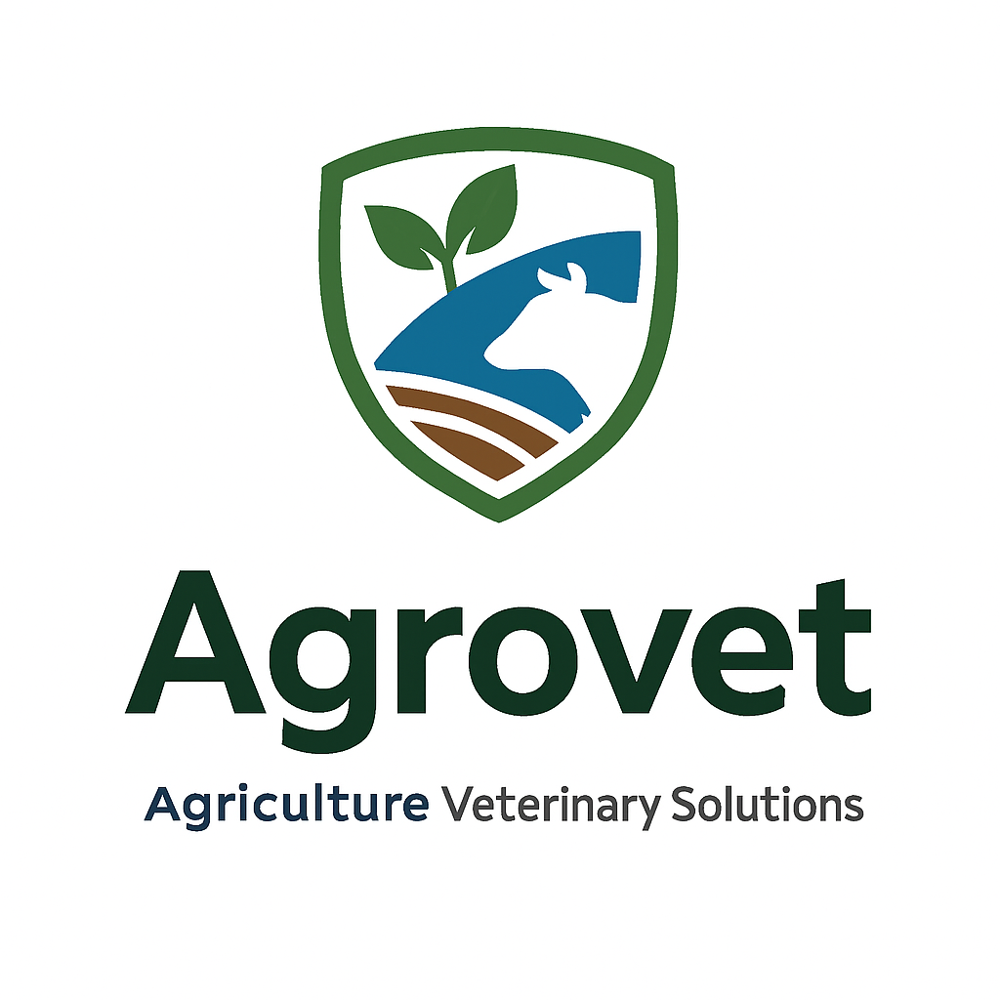
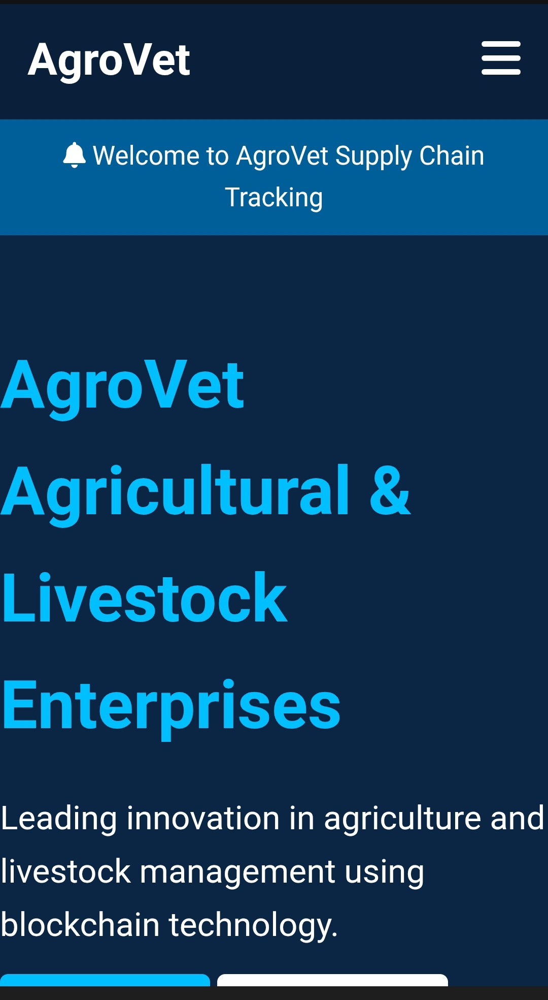

# <span style="color:#3A9E4E">🌱</span> Agrovet  
**Livestock Health & Youth Training Platform**  
*A Gkk Vet Agricultural and Livestock Enterprises Initiative*

<div align="center">
  
  <br>
  <sup>Integrated emblem: Leaf (Agriculture) + Livestock + Graduation Cap (Training)</sup>
</div>

---

## 🖥️ Homepage Preview


---

## 🔍 About Agrovet
Agrovet revolutionizes African agriculture through integrated livestock solutions and youth empowerment. As a specialized branch of Gkk Vet Enterprises, we bridge traditional farming with blockchain technology.

```mermaid
graph TD
    A[Livestock Health] -->|Vaccination & Care| B(Youth Training)
    B -->|Skill Development| C[Market Facilitation]
    C -->|Verified Products| D[Blockchain Traceability]
    D -->|Token Incentives| E[Farmer Empowerment]
    E --> A


---

🧩 Core Services

Category	Services	Technology Integration

Animal Health	• Vaccination programs<br>• Mobile veterinary clinics<br>• Preventive care systems	• Tele-Vet app<br>• IoT health sensors<br>• AI diagnostics
Youth Development	• Cattle management training<br>• Milk hygiene certification<br>• Agribusiness incubation	• Mobile learning platform<br>• Digital skill badges<br>• NFT certificates
Market Access	• Farm-to-market linkages<br>• Quality verification<br>• Buyer matchmaking	• AgroChain-HTS<br>• QR verification<br>• Smart contracts
Research & Outreach	• Farm impact studies<br>• Disease surveillance<br>• Community workshops	• Geo-tagged field data<br>• AGRO/AMG token rewards<br>• Gamified learning


---

✨ Key Features

🔗 Blockchain Integration

+ Farm-to-table traceability via Hedera Token Service
+ Immutable product history on distributed ledger
+ Real-time supply chain monitoring

🏆 Token Ecosystem

Token	Purpose	Reward Mechanism

AGRO	Primary utility token	Earned for verified farming activities
AMG	Governance token	Stake for voting rights and premium features
AGRO-Vouchers	Input redemption	Convert tokens to farm supplies/services


📱 Digital Platform Components

1. Farmer Dashboard - Health records & market access
2. Youth Training App - Interactive modules & skill tracking
3. Buyer Portal - Verified product sourcing
4. Vet Network - Remote consultation system


---

👥 Leadership Team

<div align="center">Role	Name	Expertise

Project Lead	Muhammad Sale	Agricultural Tech & Enterprise Development
Livestock Specialist	Bello Musa	Veterinary Medicine & Herd Management
Community Director	Malam Ashafa Shehu Saulawa	Rural Outreach & Youth Empowerment


</div>
---

🌍 Contact & Operations

Headquarters
📍 Yar Kutungu Road, Dutsin Safe Low-Cost, Katsina, Nigeria
📧 gkkvet2021@gmail.com
📞 +234 XXX XXX XXXX

Digital Presence
   


---

⚡ AgroChain-HTS Integration

Agrovet leverages our proprietary blockchain solution for end-to-end supply chain transparency:

sequenceDiagram
    Farmer->>+AgroChain: Registers livestock/product
    AgroChain->>+Blockchain: Creates digital twin (NFT)
    Veterinarian->>+AgroChain: Updates health records
    Blockchain->>+Consumer: Generates QR traceability code
    Consumer->>+Blockchain: Scans QR for full history
    AgroChain->>+Farmer: Issues AGRO tokens

Key Benefits:

🥩→🛒 Transparent supply chains

🔒 Tamper-proof quality verification

💰 Automated incentive distribution

👩‍💻 Youth tech engagement


---

🚀 Getting Started

1. Clone this repository

git clone https://github.com/Binkado2014/Agrovet


2. Navigate to the project directory

cd Agrovet


3. Explore folders:

frontend → Mobile/Web interfaces

smart-contracts → AGRO/AMG token code

tele-vet → Remote consultation system

docs → Project documentation

research → Field studies & data


---

🤝 Contributing

We welcome contributions from developers, researchers, and the community!

1. Fork the repo


2. Create a feature branch (git checkout -b feature-name)


3. Commit changes (git commit -m "Added feature")


4. Push to branch (git push origin feature-name)


5. Create a Pull Request


---

🛤 Roadmap

✅ Phase 1: Core Platform & Vet Network

✅ Phase 2: Blockchain Traceability & Tokens

🔄 Phase 3: Youth Training App Expansion

🔮 Phase 4: AI-driven Diagnostics & IoT Sensors


---

📜 License

MIT License

Copyright (c) 2023 Gkk Vet Agricultural and Livestock Enterprises


---

<div align="center" style="margin-top:40px;border-top:1px solid #3A9E4E;padding-top:20px">
  <strong>Partners:</strong><br>
  
  
</div>
---

✨ Agrovet — Empowering Farmers, Building the Future.

---
