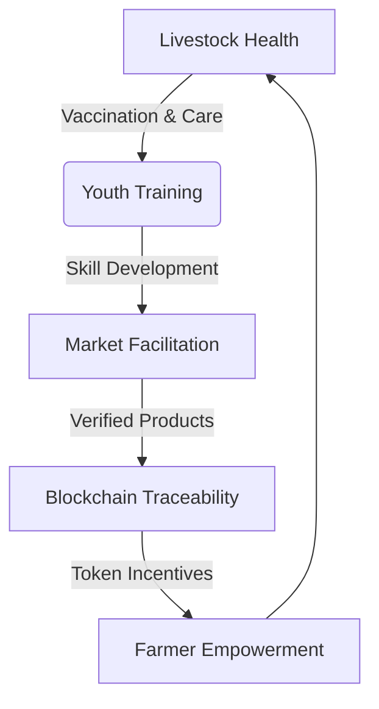
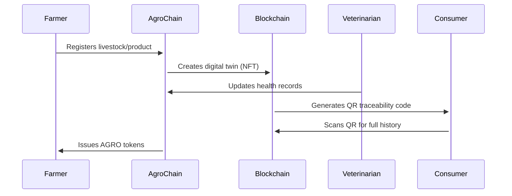

# <span style="color:#3A9E4E">🌱</span> Agrovet  
**Livestock Health & Youth Training Platform**  
*A Gkk Vet Agricultural and Livestock Enterprises Initiative*

<div align="center">
  
  <br>
  <sup>Integrated emblem: Leaf (Agriculture) + Livestock + Graduation Cap (Training)</sup>
</div>

---

## 🖥️ Homepage Preview


---

## 🔍 About Agrovet
Agrovet revolutionizes African agriculture through integrated livestock solutions and youth empowerment. As a specialized branch of Gkk Vet Enterprises, we bridge traditional farming with blockchain technology.



---

## 🧩 Core Services
| Category | Services | Technology Integration |
|----------|----------|------------------------|
| **Animal Health** | • Vaccination programs<br>• Mobile veterinary clinics<br>• Preventive care systems | • Tele-Vet app<br>• IoT health sensors<br>• AI diagnostics |
| **Youth Development** | • Cattle management training<br>• Milk hygiene certification<br>• Agribusiness incubation | • Mobile learning platform<br>• Digital skill badges<br>• NFT certificates |
| **Market Access** | • Farm-to-market linkages<br>• Quality verification<br>• Buyer matchmaking | • AgroChain-HTS<br>• QR verification<br>• Smart contracts |
| **Research & Outreach** | • Farm impact studies<br>• Disease surveillance<br>• Community workshops | • Geo-tagged field data<br>• AGRO/AMG token rewards<br>• Gamified learning |

---

## ✨ Key Features

### 🔗 Blockchain Integration
```diff
+ Farm-to-table traceability via Hedera Token Service
+ Immutable product history on distributed ledger
+ Real-time supply chain monitoring
```

### 🏆 Token Ecosystem
| Token | Purpose | Reward Mechanism |
|-------|---------|------------------|
| **AGRO** | Primary utility token | Earned for verified farming activities |
| **AMG** | Governance token | Stake for voting rights and premium features |
| **AGRO-Vouchers** | Input redemption | Convert tokens to farm supplies/services |

### 📱 Digital Platform Components
```bash
1. Farmer Dashboard - Health records & market access
2. Youth Training App - Interactive modules & skill tracking
3. Buyer Portal - Verified product sourcing
4. Vet Network - Remote consultation system
```

---

## 👥 Leadership Team
<div align="center">

| Role | Name | Expertise |
|------|------|-----------|
| **Project Lead** | Muhammad Sale | Agricultural Tech & Enterprise Development |
| **Livestock Specialist** | Bello Musa | Veterinary Medicine & Herd Management |
| **Community Director** | Malam Ashafa Shehu Saulawa | Rural Outreach & Youth Empowerment |
</div>

---

## 🌍 Contact & Operations
**Headquarters**  
📍 Yar Kutungu Road, Dutsin Safe Low-Cost, Katsina, Nigeria  
📧 [gkkvet2021@gmail.com](mailto:gkkvet2021@gmail.com)  
📞 +234 803 557 9935

**Digital Presence**  
[](https://twitter.com/) 
[](https://t.me/) 
[](https://linkedin.com/)
[](https://github.com/Binkado2014/Agrovet)

---

## ⚡ AgroChain-HTS Integration
Agrovet leverages our proprietary blockchain solution for end-to-end supply chain transparency:



**Key Benefits:**
- 🥩→🛒 Transparent supply chains
- 🔒 Tamper-proof quality verification
- 💰 Automated incentive distribution
- 👩‍💻 Youth tech engagement

---

## 🚀 Getting Started

1. Clone this repository
```bash
git clone https://github.com/Binkado2014/Agrovet
```

2. Navigate to the project directory
```bash
cd Agrovet
```

3. Explore folders:
```
frontend → Mobile/Web interfaces
smart-contracts → AGRO/AMG token code
tele-vet → Remote consultation system
docs → Project documentation
research → Field studies & data
```

---

## 🤝 Contributing
We welcome contributions from developers, researchers, and the community!

1. **Fork the repo**
2. **Create a feature branch**
```bash
git checkout -b feature-name
```
3. **Commit changes**
```bash
git commit -m "Added feature"
```
4. **Push to branch**
```bash
git push origin feature-name
```
5. **Create a Pull Request**

---

## 🛤 Roadmap
- ✅ **Phase 1:** Core Platform & Vet Network
- ✅ **Phase 2:** Blockchain Traceability & Tokens
- 🔄 **Phase 3:** Youth Training App Expansion
- 🔮 **Phase 4:** AI-driven Diagnostics & IoT Sensors

---

## 📜 License
**MIT License**

```copyright
Copyright (c) 2023 Gkk Vet Agricultural and Livestock Enterprises

Permission is hereby granted, free of charge, to any person obtaining a copy
of this software and associated documentation files (the "Software"), to deal
in the Software without restriction, including without limitation the rights
to use, copy, modify, merge, publish, distribute, sublicense, and/or sell
copies of the Software, and to permit persons to whom the Software is
furnished to do so, subject to the following conditions:

The above copyright notice and this permission notice shall be included in all
copies or substantial portions of the Software.

THE SOFTWARE IS PROVIDED "AS IS", WITHOUT WARRANTY OF ANY KIND, EXPRESS OR
IMPLIED, INCLUDING BUT NOT LIMITED TO THE WARRANTIES OF MERCHANTABILITY,
FITNESS FOR A PARTICULAR PURPOSE AND NONINFRINGEMENT. IN NO EVENT SHALL THE
AUTHORS OR COPYRIGHT HOLDERS BE LIABLE FOR ANY CLAIM, DAMAGES OR OTHER
LIABILITY, WHETHER IN AN ACTION OF CONTRACT, TORT OR OTHERWISE, ARISING FROM,
OUT OF OR IN CONNECTION WITH THE SOFTWARE OR THE USE OR OTHER DEALINGS IN THE
SOFTWARE.
```

<div align="center" style="margin-top:40px;border-top:1px solid #3A9E4E;padding-top:20px">
  <strong>Partners:</strong><br>
  
  
</div>

---

## ✨ Agrovet — Empowering Farmers, Building the Future.
```
